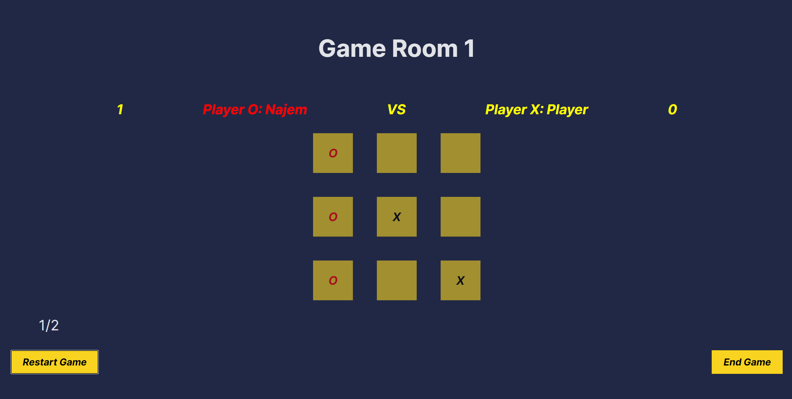

# Web Game Site 🎮

Welcome to the **Web Game Site**, a personal project where you can enjoy multiplayer and single-player games online with your friends. Currently, the platform features two games: **TicTacToe** and a **Quiz Game**, with plans to expand in the future.


## Games Available

### 🕹️ TicTacToe
A classic game brought to life using **C#**, **React**, and **WebSocket**. Enjoy both single-player and multiplayer modes!


#### Features
- **Singleplayer Mode:**  
  Play against an AI with two difficulty levels:
  - Easy 🟢
  - Hard 🔴
  
|  |  |
|-------------------------------------------------------------------------------|-------------------------------------------------------------------------------|
|  |  |

- **Multiplayer Mode:**  
  Join one of three available rooms and play with friends. The game starts as soon as another player joins your room.
  - Enter your name for personalized gameplay ✍️
  - Restart the game with mutual agreement 🌀
  - Track scores throughout the game 🏆

|  |  |
|-------------------------------------------------------------------------------|-------------------------------------------------------------------------------|
|  |  |

---

### ❓ Quiz Game
Test your knowledge by answering a series of timed questions. Compete to see how quickly you can answer each question, and review the correct answers at the end of the quiz.

- Time-based scoring system ⏲️
- Review correct answers after the quiz 📜

---

## Technologies Used 🛠️

- **Backend:** C# (.NET)
- **Frontend:** JavaScript (React)
- **API:** WebSocket

---

## Installation ⚙️

To run the project locally, follow these steps:

1. **Fork and Clone the Repository:**
    - Use your terminal to fork and clone this repository.
    ```bash
    git clone https://github.com/najemhamo/WebGameSite.git
    ```
2. **Run the Backend:**
    - Navigate to the `Backend` folder in the terminal.
    - Start the .NET project by running:
    ```bash
    dotnet run
    ```
3. **Run the Frontend:**
    - Navigate to the `Frontend` folder.
    - Install the required dependencies:
    ```bash
    npm ci
    ```
    - Install WebSocket:
    ```bash
    npm install websocket
    ```
    - Start the development server:
    ```bash
    npm run dev
    ```
4. **Access the Application:**
    - Open the link provided in your terminal to access the game site.

5. **Multiplayer Mode:**
    - Open multiple browser tabs to simulate multiplayer with friends locally.

---

## Future Updates 🛠️

- **Multiplayer Deployment:** Soon, you'll be able to play the multiplayer mode online after the game is deployed to the web.

Stay tuned for more games and updates! 🚀

---

Feel free to contribute by forking the repo or opening issues for any bugs or suggestions. 🎉


[//]: # (These are reference links used in the body of this note and get stripped out when the markdown processor does its job. There is no need to format nicely because it shouldn't be seen.)

   [dill]: <https://github.com/joemccann/dillinger>

